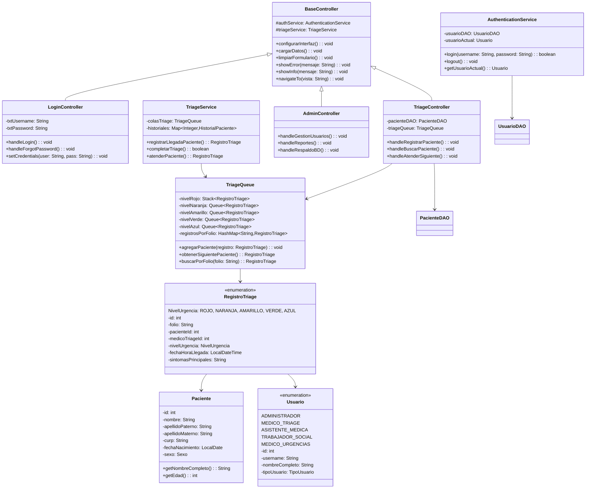
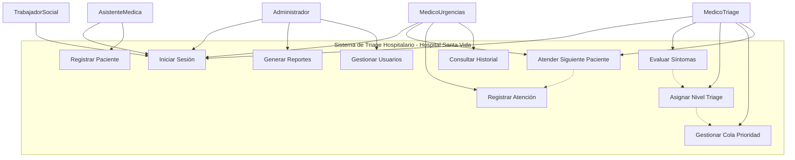

<p align="center">
  
  &nbsp;&nbsp;&nbsp;
   UC7
```

---

## 🎓 Estructuras de Datos Aplicadas

### Cola de Prioridad (Priority Queue)
- **Propósito**: Organizar pacientes según urgencia médica
- **Implementación**: Heap binario para eficiencia O(log n)
- **Criterio de prioridad**: Nivel de triage + tiempo de llegada
- **Operaciones**: Insert O(log n), ExtractMax O(log n), Peek O(1)

### HashMap
- **Propósito**: Búsqueda rápida de pacientes por ID
- **Complejidad**: O(1) promedio para búsquedas
- **Implementación**: Tabla de dispersión con manejo de colisiones

### LinkedList  
- **Propósito**: Historial de atenciones del paciente
- **Ventaja**: Inserción y eliminación eficiente O(1)
- **Uso**: Mantener secuencia cronológica de eventos

### Enum (NivelTriage)
- **Propósito**: Estandarizar niveles de urgencia médica
- **Ventaja**: Type-safety y mantenibilidad del código
- **Implementación**: Constantes con propiedades asociadas

---

## 🔍 Análisis del Problema

### Problemática Identificada
Los sistemas de urgencias hospitalarias enfrentan desafíos críticos:
- **Sobrecarga de pacientes** en horarios pico
- **Dificultad para priorizar** casos realmente urgentes
- **Tiempos de espera** inadecuados para diferentes niveles de urgencia
- **Falta de trazabilidad** en el proceso de atención

### Requisitos Funcionales
1. **RF01**: Registrar pacientes con datos básicos y síntomas
2. **RF02**: Evaluar automáticamente el nivel de triage
3. **RF03**: Mantener cola de prioridad dinámica
4. **RF04**: Llamar pacientes según urgencia médica
5. **RF05**: Registrar atención médica proporcionada

### Requisitos No Funcionales
1. **RNF01**: Tiempo de respuesta < 2 segundos
2. **RNF02**: Capacidad para 100+ pacientes simultáneos
3. **RNF03**: Interfaz intuitiva para personal médico
4. **RNF04**: Disponibilidad 24/7 del sistema
5. **RNF05**: Seguridad en datos médicos sensibles

---

## 📌 Caso de Estudio: Hospital Privado Santa Vida

El Hospital Privado **Santa Vida**, ubicado en Monterrey, enfrentaba un problema en su área de **Urgencias – Triage**:

- Los pacientes se registraban en una lista general sin diferenciar nivel de urgencia  
- Casos críticos esperaban más de lo debido  
- En emergencias masivas (ej. accidentes viales) no había un mecanismo claro de distribución  
- Faltaba rapidez para consultar expedientes cuando varios médicos atendían en paralelo  

### ❌ Problemática
Esto generaba retrasos, riesgo médico y desorganización en el área de urgencias.

### 💡 Solución Propuesta
Nuestro sistema digital de triage implementa estructuras de datos para optimizar el flujo de pacientes:

- **Pilas (Stack)** → Niveles 1 y 2 (emergencias vitales y severas)  
- **Colas (Queue)** → Niveles 3 y 4 (urgencias moderadas y menores)  
- **Listas (List)** → Nivel 5 (no urgentes)  
- **Tablas Hash** → Identificación rápida y gestión en situaciones de concurrencia  

### 📊 Ejemplo de Flujo
- Carlos (Nivel 1) → Pila de emergencias, atención inmediata  
- María (Nivel 3) → Cola de urgencia moderada  
- Luis (Nivel 5) → Lista de no urgentes  
- Ana (Nivel 2) → Prioridad en la pila sobre casos moderados  

### ✅ Beneficios
- Atención justa y priorizada  
- Orden en la sala de espera  
- Rapidez en emergencias masivas  
- Gestión hospitalaria clara y eficiente  

---

## 👥 Roles del Sistema

### 🏥 Recepcionista
- **Responsabilidades**: Registro inicial de pacientes
- **Funciones**: Capturar datos básicos de identificación
- **Acceso**: Módulo de registro únicamente

### 👩‍⚕️ Enfermera de Triage
- **Responsabilidades**: Evaluación médica y clasificación
- **Funciones**: 
  - Evaluar signos vitales y síntomas
  - Asignar nivel de triage según protocolo
  - Gestionar cola de prioridad
- **Acceso**: Módulos de evaluación y gestión de cola

### 👨‍⚕️ Médico
- **Responsabilidades**: Atención médica directa
- **Funciones**:
  - Atender pacientes según prioridad asignada
  - Registrar diagnóstico y tratamiento
  - Consultar historial médico del paciente
- **Acceso**: Módulos de atención y consulta

### 👨‍💼 Administrador
- **Responsabilidades**: Supervisión y reportes
- **Funciones**:
  - Generar reportes estadísticos del sistema
  - Configurar parámetros de triage
  - Gestionar usuarios y permisos
- **Acceso**: Módulos administrativos y de reportes

---

## ⚙ Configuración e InstalaciónSistema de gestión de triage para áreas de urgencias implementado en Java.

> ✅ **Estado:** Backend completado - Frontend en preparación

---

## 📋 INFORMACIÓN DEL PROYECTO

### Datos Académicos
- **Universidad**: TecMilenio
- **Materia**: Estructuras de Datos
- **Profesora**: Blanca Aracely Aranda Machorro
- **Ubicación**: Monterrey, Nuevo León

---

## 📑 ÍNDICE DE CONTENIDO

1. [Descripción del Proyecto](#-descripción-del-proyecto)
2. [Niveles de Triage](#-sistema-de-niveles-de-triage)
3. [Tecnologías](#️-tecnologías-implementadas)
4. [Arquitectura](#-arquitectura-del-sistema)
5. [Diseño UML](#-diseño-uml)
6. [Estructuras de Datos](#-estructuras-de-datos-aplicadas)
7. [Análisis del Problema](#-análisis-del-problema)
8. [Caso de Estudio: Hospital Privado Santa Vida](#-caso-de-estudio-hospital-privado-santa-vida)
9. [Configuración e Instalación](#-configuración-e-instalación)
10. [Avance del Proyecto](#-avance-del-proyecto)
11. [Glosario](#-glosario-de-términos)
12. [Referencias](#-bibliografía-formato-apa)
13. [Autores](#-desarrolladores)

---

## 📋 Descripción del Proyecto

### Objetivo General
Desarrollar un sistema de gestión de triage hospitalario que optimice la atención de pacientes en áreas de urgencias mediante la implementación de estructuras de datos eficientes.

### Funcionalidades Implementadas
- ✅ **Backend completo** con arquitectura MVC
- ✅ **Base de datos MySQL** con esquema hospitalario
- ✅ **Sistema de autenticación** multirol
- ✅ **Estructuras de datos especializadas** para triage
- ✅ **Servicios de negocio** completos
- 🔄 **Interfaz JavaFX** - En preparación

### Alcance del Sistema
**Incluye:**
- Registro y clasificación de pacientes
- Sistema de colas de prioridad médica
- Base de datos MySQL para persistencia
- Sistema multiusuario con 5 roles
- Reportes básicos de atención

**No incluye:**
- Historiales médicos completos
- Integración con equipos médicos
- Sistema de facturación

---

## �️ Tecnologías Implementadas

- **Java 11+** - Lenguaje principal (Java puro, sin Maven)
- **JavaFX 11+** - Framework para interfaz gráfica de usuario
- **MySQL 8.0+** - Sistema de gestión de base de datos
- **JDBC** - Conectividad con base de datos
- **Estructuras de Datos**: Stack, Queue, HashMap, LinkedList
- **Patrones de Diseño**: MVC, DAO, Singleton

---

## 📂 Arquitectura del Sistema

### Estructura de Capas (MVC) - Implementada
```
src/
├── controllers/                    # Controladores JavaFX
│   ├── BaseController.java         # Controlador base con funcionalidad común
│   ├── LoginController.java        # Autenticación de usuarios
│   ├── TriageController.java       # Evaluación y clasificación médica
│   └── AdminController.java        # Gestión administrativa
├── dao/                           # Data Access Objects
│   ├── UsuarioDAO.java            # Operaciones CRUD de usuarios
│   └── PacienteDAO.java           # Operaciones CRUD de pacientes
├── models/                        # Modelos de datos (POJOs)
│   ├── Usuario.java               # Modelo de usuario del sistema
│   ├── Paciente.java              # Modelo de paciente
│   ├── RegistroTriage.java        # Registro de evaluación de triage
│   ├── DatosSociales.java         # Información socioeconómica
│   ├── CitaMedica.java            # Programación de citas
│   └── AtencionMedica.java        # Registro de atención médica
├── services/                      # Lógica de negocio
│   ├── AuthenticationService.java # Autenticación y autorización
│   └── TriageService.java         # Gestión de colas y evaluación
├── structures/                    # Estructuras de datos especializadas
│   ├── TriageQueue.java           # Cola de prioridad para triage
│   └── HistorialPaciente.java     # Historial con LinkedList
├── utils/                         # Utilidades del sistema
│   └── DatabaseConnection.java    # Conexión y pool de BD
└── ui/                           # Archivos FXML (futuro)
```

### Componentes Implementados
- **Capa de Presentación**: Controladores base preparados para JavaFX
- **Capa de Lógica de Negocio**: Servicios de triage y autenticación completos
- **Capa de Acceso a Datos**: DAOs con operaciones CRUD implementadas
- **Capa de Datos**: Base de datos MySQL con esquema completo

---

## 📊 Diseño UML

### Diagrama de Clases - Actualizado


### Diagrama de Casos de Uso - Sistema Implementado


---

## � Configuración e Instalación

### Requisitos del Sistema

**Software Requerido:**
- **Java Development Kit (JDK) 11+**
- **JavaFX SDK 11+** 
- **MySQL Server 8.0+**
- **MySQL Connector/J (JDBC Driver)**

### 1. Configuración de Base de Datos

```sql
-- Crear base de datos
CREATE DATABASE hospital_santa_vida CHARACTER SET utf8mb4 COLLATE utf8mb4_spanish_ci;

-- Crear usuario para la aplicación
CREATE USER 'hospital_user'@'localhost' IDENTIFIED BY 'hospital_pass123';
GRANT ALL PRIVILEGES ON hospital_santa_vida.* TO 'hospital_user'@'localhost';
FLUSH PRIVILEGES;
```

### 2. Ejecutar Script de Inicialización

```bash
# Ejecutar script SQL incluido en el proyecto
mysql -u hospital_user -p hospital_santa_vida < hospital_santa_vida.sql
```

### 3. Compilación y Ejecución

```bash
# Compilar proyecto
javac -cp "lib/*;%JAVAFX_HOME%\lib\*" -d out src/**/*.java

# Ejecutar aplicación
java -cp "out;lib/*" --module-path "%JAVAFX_HOME%\lib" --add-modules javafx.controls,javafx.fxml Main
```

---

## 📈 Avance del Proyecto

### ✅ Completado (Backend)
- [x] **Análisis de requisitos** - Identificación completa de necesidades
- [x] **Diseño de arquitectura** - Estructura MVC implementada
- [x] **Diagramas UML** - Actualizados con implementación real
- [x] **Base de datos MySQL** - Esquema completo con 6 tablas
- [x] **Modelos de datos** - 6 POJOs con validaciones
- [x] **Estructuras de datos especializadas** - Stack, Queue, HashMap, LinkedList
- [x] **Capa DAO** - UsuarioDAO y PacienteDAO completos
- [x] **Servicios de negocio** - AuthenticationService y TriageService
- [x] **Controladores base** - Login, Triage y Admin preparados para JavaFX
- [x] **Sistema de autenticación** - Multiusuario con 5 roles
- [x] **Documentación técnica** - README completo con arquitectura

### � En Desarrollo (Frontend)
- [ ] **Interfaces JavaFX** - Desarrollo de vistas FXML
- [ ] **Integración controlador-vista** - Conexión de eventos JavaFX
- [ ] **Estilos CSS** - Diseño visual del sistema
- [ ] **Navegación entre vistas** - Sistema de routing

### 📅 Pendiente (Testing y Documentación Final)
- [ ] **Pruebas unitarias** de estructuras de datos implementadas
- [ ] **Pruebas de integración** entre capas del sistema
- [ ] **Manual de usuario** con capturas de pantalla
- [ ] **Presentación académica** para evaluación final

---

## � Próximos Pasos Técnicos

### Fase 1: Frontend JavaFX (Actual)
1. **Crear vistas FXML** para cada rol del sistema
2. **Implementar navegación** entre pantallas
3. **Conectar controladores** con eventos de interfaz

### Fase 2: Testing y Optimización (Próxima)
1. **Testing unitario** de cada componente
2. **Pruebas de integración** entre capas del sistema
3. **Optimización de rendimiento** del sistema completo

### Fase 3: Documentación Final
1. **Manual de usuario** con capturas de pantalla
2. **Documentación técnica** con resultados de pruebas
3. **Presentación académica** para evaluación final

---

## 📚 Glosario de Términos

### Términos Médicos

- **Triage**: Sistema de clasificación de pacientes según la urgencia de su condición médica, originado en medicina militar
- **Signos Vitales**: Medidas básicas de las funciones corporales esenciales (presión arterial, pulso, temperatura, respiración)
- **Urgencias**: Área hospitalaria especializada en la atención inmediata de emergencias médicas y trauma
- **Protocolo Manchester**: Sistema internacional de triage que clasifica pacientes en 5 niveles de prioridad

### Términos de Estructuras de Datos

- **Cola de Prioridad**: Estructura de datos abstracta donde cada elemento tiene una prioridad asociada y se procesan en orden de importancia
- **Heap Binario**: Árbol binario completo que mantiene la propiedad de heap (padre mayor/menor que hijos)
- **Complejidad Temporal**: Medida de la cantidad de tiempo que toma ejecutar un algoritmo en función del tamaño de entrada
- **HashMap**: Estructura de datos que implementa una tabla de dispersión para mapear claves a valores con acceso O(1)

### Términos de Ingeniería de Software

- **DAO (Data Access Object)**: Patrón de diseño que proporciona una interfaz abstracta para acceder a datos
- **MVC (Model-View-Controller)**: Patrón arquitectónico que separa la aplicación en tres componentes interconectados
- **JDBC**: API de Java que define cómo un cliente puede acceder a una base de datos relacional
- **UML**: Lenguaje de modelado unificado para especificar, visualizar y documentar sistemas de software

### Abreviaturas Técnicas

- **BD**: Base de Datos
- **CRUD**: Create, Read, Update, Delete (operaciones básicas de persistencia)
- **ED**: Estructuras de Datos
- **POO**: Programación Orientada a Objetos
- **API**: Application Programming Interface
- **SQL**: Structured Query Language

---

## 📖 Bibliografía (Formato APA)

### Referencias Académicas Principales

Cormen, T. H., Leiserson, C. E., Rivest, R. L., & Stein, C. (2022). *Introduction to algorithms* (4th ed.). MIT Press.

Weiss, M. A. (2020). *Data structures and algorithm analysis in Java* (3rd ed.). Pearson Education.

Silberschatz, A., Galvin, P. B., & Gagne, G. (2018). *Operating system concepts* (10th ed.). John Wiley & Sons.

### Referencias Médicas

Manchester Triage Group. (2014). *Emergency triage: Manchester triage group* (3rd ed.). BMJ Books.

World Health Organization. (2023). *Emergency care systems framework*. https://www.who.int/emergencycare

### Referencias Técnicas

Oracle Corporation. (2024). *Java SE 17 Documentation: Collections Framework*. https://docs.oracle.com/en/java/javase/17/

Fowler, M. (2018). *Patterns of enterprise application architecture* (2nd ed.). Addison-Wesley Professional.

### Fuentes Gubernamentales

Secretaría de Salud de México. (2022). *Norma Oficial Mexicana NOM-027-SSA3-2013, Regulación de los servicios de salud*. Diario Oficial de la Federación.

---

## 🎯 Objetivos de Aprendizaje Alcanzados

### Conceptos de Estructuras de Datos

- **Implementación práctica** de colas de prioridad en contexto real
- **Análisis de complejidad** temporal y espacial de algoritmos
- **Diseño de estructuras** eficientes para problemáticas específicas
- **Optimización de rendimiento** mediante selección adecuada de ED

### Habilidades de Ingeniería de Software

- **Arquitectura por capas** con separación de responsabilidades
- **Patrones de diseño** aplicados a sistemas de información
- **Documentación técnica** completa y profesional
- **Metodología de desarrollo** estructurada y planificada

### Competencias Interdisciplinarias

- **Comprensión del dominio médico** y sus requerimientos críticos
- **Trabajo en equipo** para desarrollo de sistemas complejos
- **Comunicación técnica** efectiva con stakeholders
- **Ética en el manejo** de información médica sensible

---

## 👨‍💻 Desarrolladores

<table>
  <tr>
    <td width="160" align="center">
      
    </td>
    <td>
      <b>Erick Mauricio Santiago Díaz</b><br>
      - GitHub: <a href="https://github.com/Erick-MSD">@Erick-MSD</a><br>
      - Rol: Líder del Proyecto / Desarrollador Principal
    </td>
  </tr>
  <tr>
    <td width="160" align="center">
      
    </td>
    <td>
      <b>Santiago Sebastian Rojo Marquez</b><br>
      - GitHub: <a href="https://github.com/Sanlaan">Sanlann</a><br>
      - Rol: Desarrollador / Especialista en Base de Datos
    </td>
  </tr>
  <tr>
    <td width="160" align="center">
      
    </td>
    <td>
      <b>Daniel Isai Sanchez Guadarrama</b><br>
      - GitHub: <a href="https://github.com/DanielIsaiSG">DanielIsaiSG</a><br>
      - Rol: Arquitecto del Sistema / Desarrollador
    </td>
  </tr>
  <tr>
    <td width="160" align="center">
      
    </td>
    <td>
      <b>Josue David Murillo Gomez</b><br>
      - GitHub: <a href="https://github.com/Josuemgd15">Josuemgd15</a><br>
      - Rol: Encargado de la Documentación / Desarrollador
    </td>
  </tr>
</table>

<p align="center">
  
</p>

---

## 🔚 Conclusiones y Agradecimientos

### Conclusiones del Proyecto

El desarrollo del Sistema de Triage Hospitalario ha representado una experiencia enriquecedora que nos ha permitido aplicar conocimientos teóricos de estructuras de datos en un contexto práctico y socialmente relevante. Los principales logros incluyen:

1. **Comprensión profunda** de la importancia de las estructuras de datos en sistemas críticos
2. **Desarrollo de habilidades** de análisis y diseño de software
3. **Aplicación práctica** de algoritmos de ordenamiento y búsqueda
4. **Sensibilización** sobre la responsabilidad en el desarrollo de sistemas de salud

### Impacto Académico

Este proyecto nos ha permitido integrar conocimientos de múltiples áreas: programación orientada a objetos, bases de datos, ingeniería de software y comprensión del dominio médico, demostrando la naturaleza interdisciplinaria de la ingeniería en sistemas computacionales.

### Agradecimientos

- **Profesora Blanca Aracely Aranda Machorro** por su guía experta y dedicación en la enseñanza de estructuras de datos
- **Personal médico consultado** por compartir su experiencia en procesos de triage hospitalario
- **Universidad TecMilenio** por proporcionar los recursos tecnológicos y el ambiente académico necesario
- **Compañeros de equipo** por su colaboración, compromiso y aportaciones valiosas al proyecto

---

> 📚 **Proyecto Académico TecMilenio** - Estructuras de Datos  
> 🎓 Desarrollado como parte del aprendizaje integral en ingeniería de sistemas

*© 2024 Hospital Santa Vida - Sistema de Triage. Desarrollado para Universidad Tecmilenio.*
