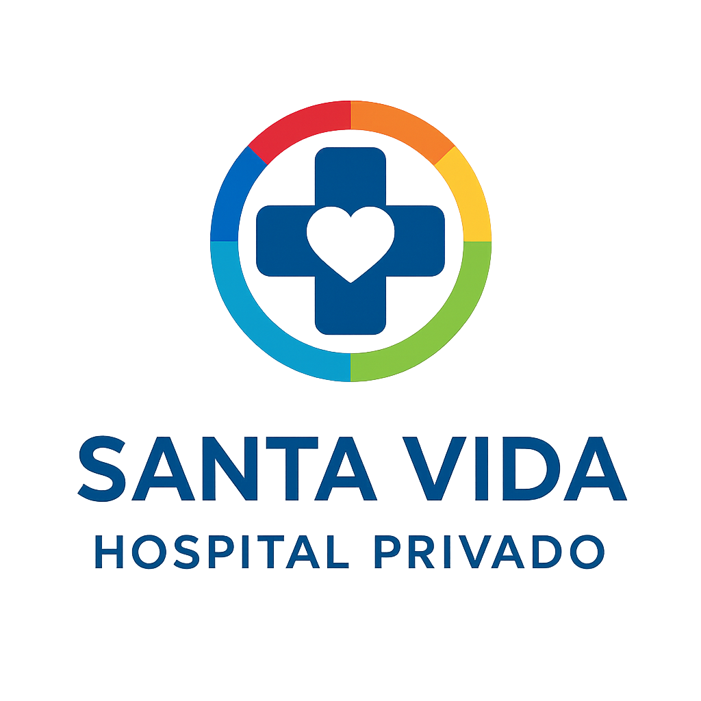
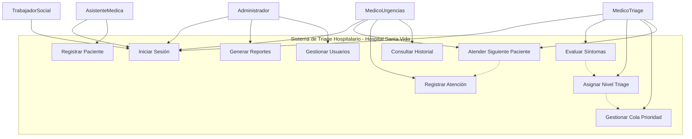
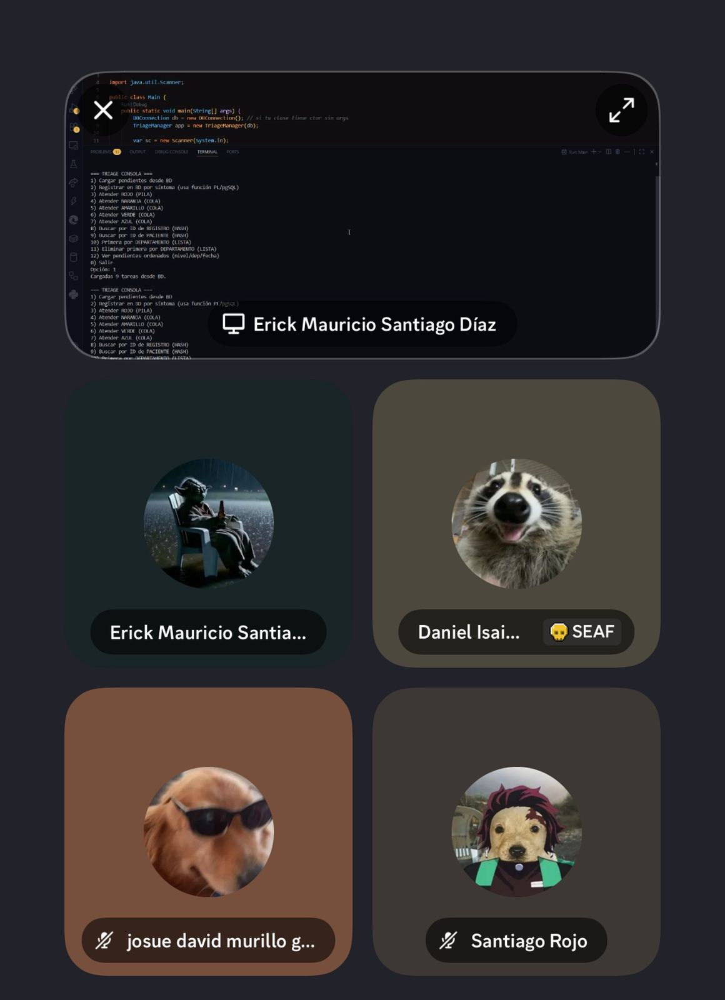

<p align="center">
  
  &nbsp;&nbsp;&nbsp;
  
</p>


# 🏥 Sistema de Triaje Hospitalario

Proyecto académico para la materia de **Estructuras de Datos** que implementa un sistema de gestión de triage para áreas de urgencias utilizando Java y estructuras de datos especializadas.

### Información Académica

  * **Universidad**: TecMilenio
  * **Materia**: Estructuras de Datos
  * **Profesora**: Blanca Aracely Aranda Machorro
  * **Ubicación**: Monterrey, Nuevo León

-----

## 📑 Índice

1.  [Caso de Estudio: Hospital Privado Santa Vida](https://www.google.com/search?q=%23-caso-de-estudio-hospital-privado-santa-vida)
      * [Problemática](https://www.google.com/search?q=%23-problem%C3%A1tica)
      * [Solución Propuesta](https://www.google.com/search?q=%23-soluci%C3%B3n-propuesta)
      * [Beneficios](https://www.google.com/search?q=%23-beneficios)
2.  [Descripción del Proyecto](https://www.google.com/search?q=%23-descripci%C3%B3n-del-proyecto)
      * [Objetivo General](https://www.google.com/search?q=%23objetivo-general)
      * [Funcionalidades y Alcance](https://www.google.com/search?q=%23funcionalidades-y-alcance)
3.  [Niveles de Triage](https://www.google.com/search?q=%23-niveles-de-triage)
4.  [Tecnologías Implementadas](https://www.google.com/search?q=%23%EF%B8%8F-tecnolog%C3%ADas-implementadas)
5.  [Arquitectura del Sistema](https://www.google.com/search?q=%23-arquitectura-del-sistema)
6.  [Diseño UML](https://www.google.com/search?q=%23-dise%C3%B1o-uml)
7.  [Estructuras de Datos Aplicadas](https://www.google.com/search?q=%23-estructuras-de-datos-aplicadas)
8.  [Análisis de Requisitos](https://www.google.com/search?q=%23-an%C3%A1lisis-de-requisitos)
9.  [Configuración e Instalación](https://www.google.com/search?q=%23-configuraci%C3%B3n-e-instalaci%C3%B3n)
10. [Avance del Proyecto](https://www.google.com/search?q=%23-avance-del-proyecto)
11. [Glosario y Referencias](https://www.google.com/search?q=%23-glosario-y-referencias)
12. [Desarrolladores](https://www.google.com/search?q=%23-desarrolladores)
13. [Objetivos de Aprendizaje Alcanzados](https://www.google.com/search?q=%23-objetivos-de-aprendizaje-alcanzados)
14. [Conclusión](https://www.google.com/search?q=%23-conclusi%C3%B3n)
15. [Agradecimientos](https://www.google.com/search?q=%23-agradecimientos)

-----

## 📌 Caso de Estudio: Hospital Privado Santa Vida

El Hospital Privado **Santa Vida**, ubicado en Monterrey, enfrentaba un problema crítico en su área de **Urgencias – Triage**: los pacientes se registraban en una lista general sin diferenciar su nivel de urgencia, lo que causaba que casos críticos esperaran más de lo debido. Además, en emergencias masivas, no existía un mecanismo claro de distribución, y la falta de rapidez para consultar expedientes generaba desorganización y retrasos.

### ❌ Problemática

Esta situación generaba **retrasos** en la atención, aumentaba el **riesgo médico** para pacientes críticos y provocaba una **desorganización general** en el área de urgencias.

### 💡 Solución Propuesta

Nuestro sistema digital de triaje implementa estructuras de datos para optimizar el flujo de pacientes. Se utilizan estructuras específicas para cada nivel de urgencia, garantizando que la prioridad se asigne de manera algorítmica y eficiente:

  * **Pilas (Stack)** → Niveles 1 y 2 (emergencias vitales y severas).
  * **Colas (Queue)** → Niveles 3 y 4 (urgencias moderadas y menores).
  * **Listas** → Nivel 5 (no urgentes).
  * **Tablas Hash** → Identificación rápida y gestión de expedientes.

#### Ejemplo de Flujo:

>   * **Carlos (Nivel 1)** → Ingresa a la Pila de emergencias para atención inmediata.
>   * **Ana (Nivel 2)** → Se apila con alta prioridad sobre casos menos urgentes.
>   * **María (Nivel 3)** → Ingresa a la Cola de urgencia moderada.
>   * **Luis (Nivel 5)** → Se añade a la Lista de no urgentes.

### ✅ Beneficios

  * **Atención justa y priorizada** según la gravedad médica.
  * **Orden y predictibilidad** en la sala de espera.
  * **Rapidez de respuesta** en emergencias masivas.
  * **Gestión hospitalaria** clara y eficiente.

-----

## 📋 Descripción del Proyecto

### Objetivo General

Desarrollar un sistema de gestión de triage hospitalario que optimice la atención de pacientes en áreas de urgencias mediante la implementación de estructuras de datos eficientes en Java.

### Funcionalidades y Alcance

**Funcionalidades Implementadas:**

  * ✅ **Backend completo** con arquitectura MVC.
  * ✅ **Base de datos MySQL** con esquema hospitalario.
  * ✅ Sistema de **autenticación multirol**.
  * ✅ **Estructuras de datos especializadas** para triaje.
  * ✅ Servicios de negocio completos.

**Alcance del Sistema:**

  * **Incluye**: Registro y clasificación de pacientes, sistema de colas de prioridad, persistencia en MySQL, 5 roles de usuario e informes básicos.
  * **No incluye**: Historias clínicas completas, integración con equipos médicos o sistema de facturación.

-----

## 🚨 Niveles de Triage

El sistema se basa en el **Protocolo Manchester**, un estándar internacional que clasifica a los pacientes en cinco niveles de urgencia, permitiendo priorizar la atención de forma efectiva.

  * 🔴 **Nivel 1 (Rojo):** Emergencia vital. Atención inmediata.
  * 🟠 **Nivel 2 (Naranja):** Urgencia severa. Casos graves con alto riesgo.
  * 🟡 **Nivel 3 (Amarillo):** Urgencia moderada. Condición estable que requiere atención.
  * 🟢 **Nivel 4 (Verde):** Urgencia menor. Casos leves que pueden esperar.
  * 🔵 **Nivel 5 (Azul):** Sin urgencia. Pacientes para consulta externa.

-----

## ⚙️ Tecnologías Implementadas

  * **Lenguaje**: Java 11+
  * **Interfaz Gráfica**: JavaFX 11+
  * **Base de Datos**: MySQL 8.0+
  * **Conectividad**: JDBC
  * **Estructuras de Datos**: Stack, Queue, HashMap, LinkedList
  * **Patrones de Diseño**: MVC, DAO, Singleton

-----

## 📂 Arquitectura del Sistema

El sistema sigue el patrón de diseño **MVC (Modelo-Vista-Controlador)** y una **arquitectura de tres capas**, garantizando una clara separación de responsabilidades que facilita el mantenimiento y la escalabilidad.

```
src/
├── controllers/      # Controladores JavaFX (Login, Triage, Admin)
├── dao/              # Data Access Objects (UsuarioDAO, PacienteDAO)
├── models/           # Modelos de datos (POJOs: Usuario, Paciente)
├── services/         # Lógica de negocio (AuthenticationService, TriageService)
├── structures/       # Estructuras de datos especializadas
├── utils/            # Utilidades (DatabaseConnection)
└── ui/               # Archivos FXML para la interfaz (futuro)
```

-----

-----

## 📊 Diseño UML

A continuación, se presentan los diagramas UML que modelan la estructura y el comportamiento del sistema.

### Diagrama de Clases


### Diagrama de Casos de Uso - Sistema Implementado



-----

## 🎓 Estructuras de Datos Aplicadas

El núcleo del sistema reside en la implementación estratégica de estructuras de datos para optimizar el flujo de pacientes.

  * **Cola de Prioridad (Priority Queue)**: Implementada con un **Heap binario** para organizar pacientes según su nivel de triaje y tiempo de llegada, con operaciones eficientes `O(log n)`.
  * **Mapa Hash (HashMap)**: Para la búsqueda instantánea de pacientes por ID, con una complejidad promedio de `O(1)`.
  * **Lista Enlazada (LinkedList)**: Para almacenar el historial de atenciones de cada paciente en orden cronológico, permitiendo inserciones eficientes en `O(1)`.
  * **Enumeración (Enum)**: Para estandarizar los niveles de triaje (`NivelTriage`), garantizando la seguridad de tipos y la mantenibilidad del código.

-----

## 🔍 Análisis de Requisitos

#### Requisitos Funcionales

  * **RF01**: Registrar pacientes con datos básicos y síntomas.
  * **RF02**: Evaluar y asignar un nivel de triaje.
  * **RF03**: Mantener una cola de prioridad dinámica.
  * **RF04**: Llamar pacientes según su urgencia.
  * **RF05**: Registrar la atención médica proporcionada.

#### Requisitos No Funcionales

  * **RNF01**: Tiempo de respuesta del sistema \< 2 segundos.
  * **RNF02**: Capacidad para +100 pacientes simultáneos.
  * **RNF03**: Interfaz de usuario intuitiva.
  * **RNF04**: Disponibilidad 24/7.
  * **RNF05**: Seguridad en el manejo de datos médicos.

-----

## ⚙️ Configuración e Instalación

**Requisitos:**

  * JDK 11+
  * JavaFX SDK 11+
  * MySQL Server 8.0+
  * MySQL Connector/J

**1. Configuración de Base de Datos:**

```sql
-- Crear la base de datos
CREATE DATABASE hospital_santa_vida CHARACTER SET utf8mb4 COLLATE utf8mb4_spanish_ci;

-- Crear un usuario para la aplicación
CREATE USER 'hospital_user'@'localhost' IDENTIFIED BY 'hospital_pass123';
GRANT ALL PRIVILEGES ON hospital_santa_vida.* TO 'hospital_user'@'localhost';
FLUSH PRIVILEGES;
```

**2. Ejecutar Script de Inicialización:**

```bash
# Ejecutar el script SQL incluido en el proyecto
mysql -u hospital_user -p hospital_santa_vida < hospital_santa_vida.sql
```

**3. Compilación y Ejecución:**

```bash
# Compilar el proyecto
.\compile.bat

# Ejecutar la aplicación
.\run.bat
```

-----

## 📈 Avance del Proyecto

  * ✅ **Completado (Backend):** Análisis, diseño de arquitectura, diagramas UML, base de datos, modelos, DAOs, servicios, controladores base y sistema de autenticación.
  * ⏳ **En Desarrollo (Frontend):** Interfaces en JavaFX, integración de vistas y controladores, y estilos CSS.
  * 📅 **Pendiente:** Pruebas unitarias y de integración, manual de usuario y presentación académica final.

-----

## 📚 Glosario de Términos

### Términos Médicos

  * *Triage*: Sistema de clasificación de pacientes según la urgencia de su condición médica, originado en medicina militar.
  * *Signos Vitales*: Medidas básicas de las funciones corporales esenciales (presión arterial, pulso, temperatura, respiración).
  * *Urgencias*: Área hospitalaria especializada en la atención inmediata de emergencias médicas y trauma.
  * *Protocolo Manchester*: Sistema internacional de triage que clasifica pacientes en 5 niveles de prioridad.

### Términos de Estructuras de Datos

  * *Cola de Prioridad*: Estructura de datos abstracta donde cada elemento tiene una prioridad asociada y se procesan en orden de importancia.
  * *Heap Binario*: Árbol binario completo que mantiene la propiedad de heap (padre mayor/menor que hijos).
  * *Complejidad Temporal*: Medida de la cantidad de tiempo que toma ejecutar un algoritmo en función del tamaño de entrada.
  * *HashMap*: Estructura de datos que implementa una tabla de dispersión para mapear claves a valores con acceso O(1).

### Términos de Ingeniería de Software

  * *DAO (Data Access Object)*: Patrón de diseño que proporciona una interfaz abstracta para acceder a datos.
  * *MVC (Model-View-Controller)*: Patrón arquitectónico que separa la aplicación en tres componentes interconectados.
  * *JDBC*: API de Java que define cómo un cliente puede acceder a una base de datos relacional.
  * *UML*: Lenguaje de modelado unificado para especificar, visualizar y documentar sistemas de software.

### Abreviaturas Técnicas

  * *BD*: Base de Datos
  * *CRUD*: Create, Read, Update, Delete
  * *ED*: Estructuras de Datos
  * *POO*: Programación Orientada a Objetos
  * *API*: Application Programming Interface
  * *SQL*: Structured Query Language

-----

## 👨‍💻 Desarrolladores  

<table>
  <tr>
    <td width="160" align="center">
      
    </td>
    <td>
      <b>Erick Mauricio Santiago Díaz</b><br>
      - GitHub: <a href="https://github.com/Erick-MSD">@Erick-MSD</a><br>
      - Rol: Líder del Proyecto / Desarrollador Principal
    </td>
  </tr>
  <tr>
    <td width="160" align="center">
      
    </td>
    <td>
      <b>Santiago Sebastian Rojo Marquez</b><br>
      - GitHub: <a href="https://github.com/Sanlaan">Sanlann</a><br>
      - Rol: Desarrollador / Especialista en Base de Datos
    </td>
  </tr>
  <tr>
    <td width="160" align="center">
      
    </td>
    <td>
      <b>Daniel Isai Sanchez Guadarrama</b><br>
      - GitHub: <a href="https://github.com/DanielIsaiSG">DanielIsaiSG</a><br>
      - Rol: Arquitecto del Sistema / Desarrollador
    </td>
  </tr>
  <tr>
    <td width="160" align="center">
      
    </td>
    <td>
      <b>Josue David Murillo Gomez</b><br>
      - GitHub: <a href="https://github.com/Josuemgd15">Josuemgd15</a><br>
      - Rol: Encargado de la Documentación / Desarrollador
    </td>
  </tr>
</table>

<p align="center">  </p>
-----


## 🎯 Objetivos de Aprendizaje Alcanzados

  * **Conceptos de Estructuras de Datos**: Implementación práctica de colas de prioridad, análisis de complejidad y diseño de estructuras eficientes para problemas reales.
  * **Ingeniería de Software**: Aplicación de arquitectura por capas (MVC), patrones de diseño (DAO) y documentación técnica profesional.
  * **Competencias Interdisciplinarias**: Comprensión del dominio médico, trabajo en equipo para sistemas complejos y ética en el manejo de información sensible.

-----

## ✨ Conclusión

El desarrollo del **Sistema de Triaje Hospitalario** ha sido un ejercicio fundamental para materializar los conceptos teóricos de la materia de **Estructuras de Datos** en una solución con un impacto tangible y socialmente relevante. El proyecto demuestra de manera efectiva cómo la elección correcta de estructuras de datos —como las colas de prioridad y las tablas hash— no es solo un requisito técnico, sino la base para crear sistemas eficientes, justos y capaces de optimizar procesos críticos en entornos de alta presión como una sala de urgencias.

A través de este trabajo, hemos consolidado nuestras habilidades en diseño de software, arquitectura de sistemas y gestión de bases de datos, validando la importancia de una buena planificación y una metodología de desarrollo estructurada. Este proyecto no solo cumple con los objetivos académicos, sino que también nos ha sensibilizado sobre la responsabilidad que conlleva desarrollar tecnología para el sector de la salud.

-----

## 🙏 Agradecimientos

  * A nuestra profesora **Blanca Aracely Aranda Machorro** por su guía y dedicación.
  * Al personal médico consultado por compartir su invaluable experiencia.
  * A la **Universidad TecMilenio** por proporcionar el entorno académico y los recursos necesarios.
  * A todos los **compañeros de equipo** por su compromiso, colaboración y valiosas aportaciones.

-----

\<p align="center"\>
\<small\>🎓 Proyecto Académico TecMilenio - Estructuras de Datos © 2024\</small\>
\</p\>
