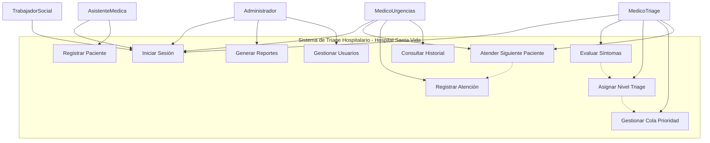

A continuación, se presenta la versión mejorada y reordenada del archivo README, siguiendo las instrucciones de organización solicitadas.

-----

\<p align="center"\>
\
\&nbsp;\&nbsp;\&nbsp;
\
\</p\>

\<h1 align="center"\>🏥 Sistema de Triage Hospitalario\</h1\>
\<p align="center"\>
**Proyecto académico** para la materia de **Estructuras de Datos**
\</p\>

-----

## 📑 Índice de Contenido

1.  [Descripción del Proyecto](https://www.google.com/search?q=%23-descripci%C3%B3n-del-proyecto)
2.  [Niveles de Triage](https://www.google.com/search?q=%23-niveles-de-triage)
3.  [Tecnologías](https://www.google.com/search?q=%23%EF%B8%8F-tecnolog%C3%ADas-implementadas)
4.  [Arquitectura](https://www.google.com/search?q=%23-arquitectura-del-sistema)
5.  [Diseño UML](https://www.google.com/search?q=%23-dise%C3%B1o-uml)
6.  [Estructuras de Datos](https://www.google.com/search?q=%23-estructuras-de-datos-aplicadas)
7.  [Análisis del Problema](https://www.google.com/search?q=%23-an%C3%A1lisis-del-problema)
8.  [Caso de Estudio: Hospital Privado Santa Vida](https://www.google.com/search?q=%23-caso-de-estudio-hospital-privado-santa-vida)
9.  [Configuración e Instalación](https://www.google.com/search?q=%23-configuraci%C3%B3n-e-instalaci%C3%B3n)
10. [Avance del Proyecto](https://www.google.com/search?q=%23-avance-del-proyecto)
11. [Glosario](https://www.google.com/search?q=%23-glosario-de-t%C3%A9rminos)
12. [Referencias](https://www.google.com/search?q=%23-bibliograf%C3%ADa-formato-apa)
13. [Autores](https://www.google.com/search?q=%23-desarrolladores)

-----

## 📌 Caso de Estudio: Hospital Privado Santa Vida

El Hospital Privado **Santa Vida**, ubicado en Monterrey, enfrentaba un problema crítico en su área de **Urgencias – Triage**: los pacientes se registraban en una lista general sin diferenciar su nivel de urgencia, lo que causaba que casos críticos esperaran más de lo debido. Además, en emergencias masivas, no existía un mecanismo claro de distribución, y la falta de rapidez para consultar expedientes generaba desorganización y retrasos.

### ❌ Problemática

Esto generaba **retrasos**, **riesgo médico** y **desorganización** en el área de urgencias.

### 💡 Solución Propuesta

Nuestro sistema digital de triage implementa estructuras de datos para optimizar el flujo de pacientes. Se utilizan estructuras de datos **específicas para cada nivel de urgencia**:

  * **Pilas (Stack)** → Niveles 1 y 2 (emergencias vitales y severas)
  * **Colas (Queue)** → Niveles 3 y 4 (urgencias moderadas y menores)
  * **Listas (List)** → Nivel 5 (no urgentes)
  * **Tablas Hash** → Identificación rápida y gestión en situaciones de concurrencia

### 📊 Ejemplo de Flujo

  * **Carlos (Nivel 1)** → Pila de emergencias, atención inmediata
  * **María (Nivel 3)** → Cola de urgencia moderada
  * **Luis (Nivel 5)** → Lista de no urgentes
  * **Ana (Nivel 2)** → Prioridad en la pila sobre casos moderados

### ✅ Beneficios

  * Atención **justa y priorizada**
  * **Orden** en la sala de espera
  * **Rapidez** en emergencias masivas
  * Gestión hospitalaria **clara y eficiente**

-----

## 📋 Descripción del Proyecto

Sistema de gestión de triage para áreas de urgencias implementado en Java.

> ✅ **Estado:** Backend completado - Frontend en preparación

### Objetivo General

Desarrollar un sistema de gestión de triage hospitalario que optimice la atención de pacientes en áreas de urgencias mediante la implementación de estructuras de datos eficientes.

### Funcionalidades Implementadas

  * ✅ **Backend completo** con arquitectura MVC
  * ✅ **Base de datos MySQL** con esquema hospitalario
  * ✅ **Sistema de autenticación** multirol
  * ✅ **Estructuras de datos especializadas** para triage
  * ✅ **Servicios de negocio** completos
  * 🔄 **Interfaz JavaFX** - En preparación

### Alcance del Sistema

**Incluye:**

  * Registro y clasificación de pacientes
  * Sistema de colas de prioridad médica
  * Base de datos MySQL para persistencia
  * Sistema multiusuario con 5 roles
  * Reportes básicos de atención

**No incluye:**

  * Historiales médicos completos
  * Integración con equipos médicos
  * Sistema de facturación

### Datos Académicos

  * **Universidad**: TecMilenio
  * **Materia**: Estructuras de Datos
  * **Profesora**: Blanca Aracely Aranda Machorro
  * **Ubicación**: Monterrey, Nuevo León

-----

## 🚨 Niveles de Triage

El sistema se basa en el **Protocolo Manchester**, un estándar internacional que clasifica a los pacientes en cinco niveles de urgencia médica. Cada nivel se identifica con un color y un criterio de tiempo de espera, lo que permite priorizar la atención de forma efectiva.

  * **🔴 Nivel 1 (Rojo):** Emergencia vital. Pacientes que requieren atención inmediata y cuya vida está en riesgo.
  * **🟠 Nivel 2 (Naranja):** Urgencia severa. Casos graves con alto riesgo potencial que deben ser atendidos con rapidez.
  * **🟡 Nivel 3 (Amarillo):** Urgencia moderada. Condición estable, pero que requiere atención médica en un tiempo razonable.
  * **🟢 Nivel 4 (Verde):** Urgencia menor. Casos leves que pueden esperar sin riesgo.
  * **🔵 Nivel 5 (Azul):** Sin urgencia. Pacientes que pueden ser atendidos en una consulta externa o en un centro de salud.

-----

## ⚙️ Tecnologías Implementadas

El proyecto se desarrolló utilizando un conjunto de herramientas y tecnologías específicas para un sistema robusto y escalable.

  * **Java 11+** - Lenguaje principal (Java puro, sin Maven)
  * **JavaFX 11+** - Framework para interfaz gráfica de usuario
  * **MySQL 8.0+** - Sistema de gestión de base de datos
  * **JDBC** - Conectividad con base de datos
  * **Estructuras de Datos**: Stack, Queue, HashMap, LinkedList
  * **Patrones de Diseño**: MVC, DAO, Singleton

-----

## 📂 Arquitectura del Sistema

El sistema sigue el **patrón de arquitectura de tres capas** y el patrón de diseño **MVC (Modelo-Vista-Controlador)**, lo que garantiza una clara separación de responsabilidades, facilitando el desarrollo y el mantenimiento.

### Estructura de Capas (MVC) - Implementada

```
src/
├── controllers/                   # Controladores JavaFX
│   ├── BaseController.java
│   ├── LoginController.java
│   ├── TriageController.java
│   └── AdminController.java
├── dao/                           # Data Access Objects
│   ├── UsuarioDAO.java
│   └── PacienteDAO.java
├── models/                        # Modelos de datos (POJOs)
│   ├── Usuario.java
│   ├── Paciente.java
│   ├── RegistroTriage.java
│   ├── DatosSociales.java
│   ├── CitaMedica.java
│   └── AtencionMedica.java
├── services/                      # Lógica de negocio
│   ├── AuthenticationService.java
│   └── TriageService.java
├── structures/                    # Estructuras de datos especializadas
│   ├── TriageQueue.java
│   └── HistorialPaciente.java
├── utils/                         # Utilidades del sistema
│   └── DatabaseConnection.java
└── ui/                            # Archivos FXML (futuro)
```

### Componentes Implementados

  * **Capa de Presentación**: Controladores base preparados para JavaFX
  * **Capa de Lógica de Negocio**: Servicios de triage y autenticación completos
  * **Capa de Acceso a Datos**: DAOs con operaciones CRUD implementadas
  * **Capa de Datos**: Base de datos MySQL con esquema completo

-----

## 📊 Diseño UML

A continuación, se presentan los diagramas UML que modelan la estructura y el comportamiento del sistema.

### Diagrama de Clases - Actualizado


### Diagrama de Casos de Uso - Sistema Implementado



-----

## 🎓 Estructuras de Datos Aplicadas

El núcleo del sistema reside en la implementación estratégica de **estructuras de datos avanzadas** para optimizar el flujo de pacientes y la gestión de la información.

### Cola de Prioridad (Priority Queue)

  * **Propósito**: Organizar pacientes según urgencia médica
  * **Implementación**: Heap binario para eficiencia O(log n)
  * **Criterio de prioridad**: Nivel de triage + tiempo de llegada
  * **Operaciones**: Insert O(log n), ExtractMax O(log n), Peek O(1)

### HashMap

  * **Propósito**: Búsqueda rápida de pacientes por ID
  * **Complejidad**: O(1) promedio para búsquedas
  * **Implementación**: Tabla de dispersión con manejo de colisiones

### LinkedList

  * **Propósito**: Historial de atenciones del paciente
  * **Ventaja**: Inserción y eliminación eficiente O(1)
  * **Uso**: Mantener secuencia cronológica de eventos

### Enum (NivelTriage)

  * **Propósito**: Estandarizar niveles de urgencia médica
  * **Ventaja**: Type-safety y mantenibilidad del código
  * **Implementación**: Constantes con propiedades asociadas

-----

## 🔍 Análisis del Problema

### Problemática Identificada

Los sistemas de urgencias hospitalarias enfrentan desafíos críticos:

  * **Sobrecarga de pacientes** en horarios pico
  * **Dificultad para priorizar** casos realmente urgentes
  * **Tiempos de espera** inadecuados para diferentes niveles de urgencia
  * **Falta de trazabilidad** en el proceso de atención

### Requisitos Funcionales

1.  **RF01**: Registrar pacientes con datos básicos y síntomas
2.  **RF02**: Evaluar automáticamente el nivel de triage
3.  **RF03**: Mantener cola de prioridad dinámica
4.  **RF04**: Llamar pacientes según urgencia médica
5.  **RF05**: Registrar atención médica proporcionada

### Requisitos No Funcionales

1.  **RNF01**: Tiempo de respuesta \< 2 segundos
2.  **RNF02**: Capacidad para 100+ pacientes simultáneos
3.  **RNF03**: Interfaz intuitiva para personal médico
4.  **RNF04**: Disponibilidad 24/7 del sistema
5.  **RNF05**: Seguridad en datos médicos sensibles

### Roles del Sistema

El sistema cuenta con una arquitectura multirol para gestionar los permisos de los usuarios de manera segura.

  * **🏥 Recepcionista**: Registro inicial de pacientes.
  * **👩‍⚕️ Enfermera de Triage**: Evaluación médica y clasificación.
  * **👨‍⚕️ Médico**: Atención médica directa.
  * **👨‍💼 Administrador**: Supervisión y reportes.

-----

## ⚙ Configuración e Instalación

### Requisitos del Sistema

**Software Requerido:**

  * **Java Development Kit (JDK) 11+**
  * **JavaFX SDK 11+**
  * **MySQL Server 8.0+**
  * **MySQL Connector/J (JDBC Driver)**

### 1\. Configuración de Base de Datos

```sql
-- Crear base de datos
CREATE DATABASE hospital_santa_vida CHARACTER SET utf8mb4 COLLATE utf8mb4_spanish_ci;

-- Crear usuario para la aplicación
CREATE USER 'hospital_user'@'localhost' IDENTIFIED BY 'hospital_pass123';
GRANT ALL PRIVILEGES ON hospital_santa_vida.* TO 'hospital_user'@'localhost';
FLUSH PRIVILEGES;
```

### 2\. Ejecutar Script de Inicialización

```bash
# Ejecutar script SQL incluido en el proyecto
mysql -u hospital_user -p hospital_santa_vida < hospital_santa_vida.sql
```

### 3\. Compilación y Ejecución

```bash
# Compilar proyecto
javac -cp "lib/*;%JAVAFX_HOME%\lib\*" -d out src/**/*.java

# Ejecutar aplicación
java -cp "out;lib/*" --module-path "%JAVAFX_HOME%\lib" --add-modules javafx.controls,javafx.fxml Main
```

-----

## 📈 Avance del Proyecto

### ✅ Completado (Backend)

  * [x] **Análisis de requisitos**
  * [x] **Diseño de arquitectura**
  * [x] **Diagramas UML**
  * [x] **Base de datos MySQL**
  * [x] **Modelos de datos**
  * [x] **Estructuras de datos especializadas**
  * [x] **Capa DAO**
  * [x] **Servicios de negocio**
  * [x] **Controladores base**
  * [x] **Sistema de autenticación**
  * [x] **Documentación técnica**

### ⏳ En Desarrollo (Frontend)

  * [ ] **Interfaces JavaFX** - Desarrollo de vistas FXML
  * [ ] **Integración controlador-vista** - Conexión de eventos JavaFX
  * [ ] **Estilos CSS** - Diseño visual del sistema
  * [ ] **Navegación entre vistas** - Sistema de routing

### 📅 Pendiente (Testing y Documentación Final)

  * [ ] **Pruebas unitarias** y de integración
  * [ ] **Manual de usuario** con capturas de pantalla
  * [ ] **Presentación académica** para evaluación final

### Próximos Pasos Técnicos

  * **Fase 1: Frontend JavaFX** (Actual)
  * **Fase 2: Testing y Optimización** (Próxima)
  * **Fase 3: Documentación Final**

-----

## 📚 Glosario de Términos

### Términos Médicos

  * **Triage**: Sistema de clasificación de pacientes según la urgencia de su condición médica, originado en medicina militar.
  * **Signos Vitales**: Medidas básicas de las funciones corporales esenciales (presión arterial, pulso, temperatura, respiración).
  * **Urgencias**: Área hospitalaria especializada en la atención inmediata de emergencias médicas y trauma.
  * **Protocolo Manchester**: Sistema internacional de triage que clasifica pacientes en 5 niveles de prioridad.

### Términos de Estructuras de Datos

  * **Cola de Prioridad**: Estructura de datos abstracta donde cada elemento tiene una prioridad asociada y se procesan en orden de importancia.
  * **Heap Binario**: Árbol binario completo que mantiene la propiedad de heap (padre mayor/menor que hijos).
  * **Complejidad Temporal**: Medida de la cantidad de tiempo que toma ejecutar un algoritmo en función del tamaño de entrada.
  * **HashMap**: Estructura de datos que implementa una tabla de dispersión para mapear claves a valores con acceso O(1).

### Términos de Ingeniería de Software

  * **DAO (Data Access Object)**: Patrón de diseño que proporciona una interfaz abstracta para acceder a datos.
  * **MVC (Model-View-Controller)**: Patrón arquitectónico que separa la aplicación en tres componentes interconectados.
  * **JDBC**: API de Java que define cómo un cliente puede acceder a una base de datos relacional.
  * **UML**: Lenguaje de modelado unificado para especificar, visualizar y documentar sistemas de software.

### Abreviaturas Técnicas

  * **BD**: Base de Datos
  * **CRUD**: Create, Read, Update, Delete
  * **ED**: Estructuras de Datos
  * **POO**: Programación Orientada a Objetos
  * **API**: Application Programming Interface
  * **SQL**: Structured Query Language

-----

## 📖 Bibliografía (Formato APA)

### Referencias Académicas Principales

  * Cormen, T. H., Leiserson, C. E., Rivest, R. L., & Stein, C. (2022). *Introduction to algorithms* (4th ed.). MIT Press.
  * Weiss, M. A. (2020). *Data structures and algorithm analysis in Java* (3rd ed.). Pearson Education.
  * Silberschatz, A., Galvin, P. B., & Gagne, G. (2018). *Operating system concepts* (10th ed.). John Wiley & Sons.

### Referencias Médicas

  * Manchester Triage Group. (2014). *Emergency triage: Manchester triage group* (3rd ed.). BMJ Books.
  * World Health Organization. (2023). *Emergency care systems framework*. [https://www.who.int/emergencycare](https://www.who.int/emergencycare)

### Referencias Técnicas

  * Oracle Corporation. (2024). *Java SE 17 Documentation: Collections Framework*. [https://docs.oracle.com/en/java/javase/17/](https://docs.oracle.com/en/java/javase/17/)
  * Fowler, M. (2018). *Patterns of enterprise application architecture* (2nd ed.). Addison-Wesley Professional.

-----

## 👨‍💻 Desarrolladores

| | |
| :--- | :--- |
| \<p align="center"\>\\</p\> | **Erick Mauricio Santiago Díaz**<br>- GitHub: \<a href="[https://github.com/Erick-MSD](https://github.com/Erick-MSD)"\>@Erick-MSD\</a\><br>- Rol: Líder del Proyecto / Desarrollador Principal |
| \<p align="center"\>\\</p\> | **Santiago Sebastian Rojo Marquez**<br>- GitHub: \<a href="[https://github.com/Sanlaan](https://github.com/Sanlaan)"\>Sanlann\</a\><br>- Rol: Desarrollador / Especialista en Base de Datos |
| \<p align="center"\>\\</p\> | **Daniel Isai Sanchez Guadarrama**<br>- GitHub: \<a href="[https://github.com/DanielIsaiSG](https://github.com/DanielIsaiSG)"\>DanielIsaiSG\</a\><br>- Rol: Arquitecto del Sistema / Desarrollador |
| \<p align="center"\>\\</p\> | **Josue David Murillo Gomez**<br>- GitHub: \<a href="[https://github.com/Josuemgd15](https://github.com/Josuemgd15)"\>Josuemgd15\</a\><br>- Rol: Encargado de la Documentación / Desarrollador |

\<p align="center"\>
\
\</p\>

-----

## 🎯 Objetivos de Aprendizaje Alcanzados

### Conceptos de Estructuras de Datos

  * **Implementación práctica** de colas de prioridad en contexto real
  * **Análisis de complejidad** temporal y espacial de algoritmos
  * **Diseño de estructuras** eficientes para problemáticas específicas
  * **Optimización de rendimiento** mediante selección adecuada de ED

### Habilidades de Ingeniería de Software

  * **Arquitectura por capas** con separación de responsabilidades
  * **Patrones de diseño** aplicados a sistemas de información
  * **Documentación técnica** completa y profesional
  * **Metodología de desarrollo** estructurada y planificada

### Competencias Interdisciplinarias

  * **Comprensión del dominio médico** y sus requerimientos críticos
  * **Trabajo en equipo** para desarrollo de sistemas complejos
  * **Comunicación técnica** efectiva con stakeholders
  * **Ética en el manejo** de información médica sensible

-----

## 🔚 Conclusiones y Agradecimientos

### Conclusiones del Proyecto

El desarrollo del Sistema de Triage Hospitalario ha representado una experiencia enriquecedora que nos ha permitido aplicar conocimientos teóricos de estructuras de datos en un contexto práctico y socialmente relevante. Los principales logros incluyen:

1.  **Comprensión profunda** de la importancia de las estructuras de datos en sistemas críticos
2.  **Desarrollo de habilidades** de análisis y diseño de software
3.  **Aplicación práctica** de algoritmos de ordenamiento y búsqueda
4.  **Sensibilización** sobre la responsabilidad en el desarrollo de sistemas de salud

### Impacto Académico

Este proyecto nos ha permitido integrar conocimientos de múltiples áreas: programación orientada a objetos, bases de datos, ingeniería de software y comprensión del dominio médico, demostrando la naturaleza interdisciplinaria de la ingeniería en sistemas computacionales.

### Agradecimientos

  * **Profesora Blanca Aracely Aranda Machorro** por su guía experta y dedicación en la enseñanza de estructuras de datos.
  * **Personal médico consultado** por compartir su experiencia en procesos de triage hospitalario.
  * **Universidad TecMilenio** por proporcionar los recursos tecnológicos y el ambiente académico necesario.
  * **Compañeros de equipo** por su colaboración, compromiso y aportaciones valiosas al proyecto.

-----

> 📚 **Proyecto Académico TecMilenio** - Estructuras de Datos
> 🎓 Desarrollado como parte del aprendizaje integral en ingeniería de sistemas

*© 2024 Hospital Santa Vida - Sistema de Triage. Desarrollado para Universidad Tecmilenio.*
